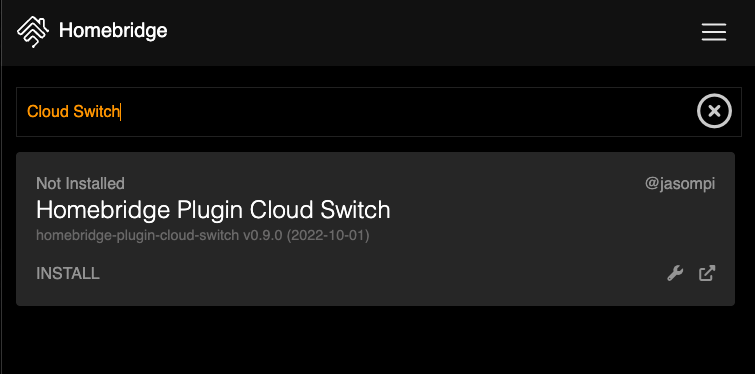
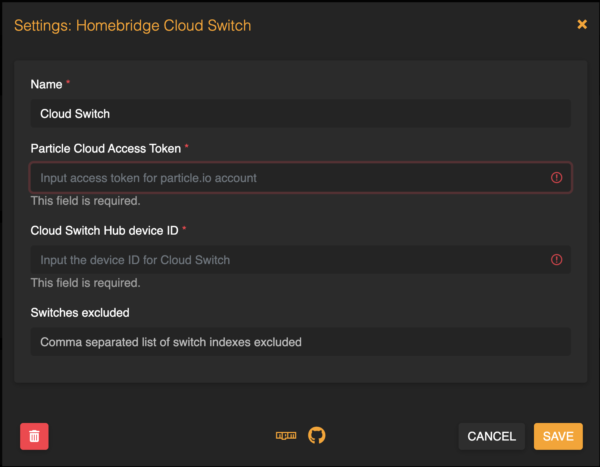

<p align="center">


</p>

# Homebridge Cloud Switch Plugin

This is the [Homebridge](https://homebridge.io/) plugin for [Cloud Switch](https://github.com/jasompi/CloudSwitch). The plugin enable the HomeKit to control [Cloud Switch](https://github.com/jasompi/CloudSwitch).

## Installation

You need to follow [Cloud Switch Instrutions](https://github.com/jasompi/CloudSwitch) to setup Cloud Switch. Once Cloud Switch works, you can install the NPM Plugin or search for `cloud switch` in Homebridge UI.

```bash
npm install -g homebridge-plugin-cloud-switch
```

## Configuration

You need to specify the particle cloud access token and device ID in the Cloud Switch Config JSON or in the Settings UI. The access token and device ID can be obtained using the [particle CLI](https://docs.particle.io/getting-started/developer-tools/cli/).

To create a new access token using::

```bash
particle token create
```

To get the device ID using:

```bash
particle list
```



Switches configured in the [Cloud Switch iOS App](https://github.com/jasompi/CloudSwitch/tree/main/iOS) will show up in the Home App on iOS device after you pair the bridge. If you want to hide some switches from the Home App, you can specify indexes in the `Switches excluded` field.
